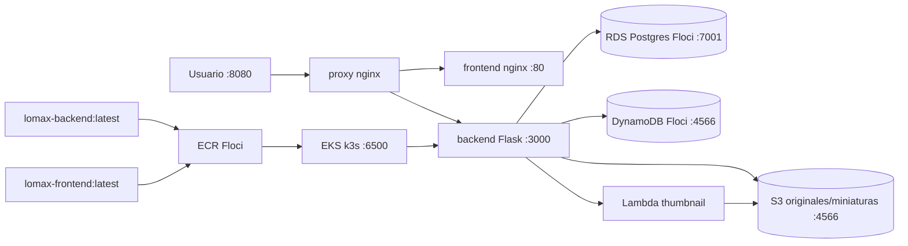

# Diagrama Lomax (desplegado = diagrama)

- Red `lomax_net`, volumen `floci-data`. Solo proxy publica al host (:8080); Floci :4566 publicado solo por el data-plane ECR que usa el daemon.
- EKS k3s real vía Floci (endpoint `https://localhost:6500`). Pods resuelven `floci` por `hostAliases` a `192.168.96.2` (documentado en `infra/eks/deploy.yaml`) porque k3s no ve los alias de Compose.
- Auth EKS con usuario IAM `eks-admin` (el par `test/test` lo rechaza el webhook a propósito).
- ECR con `URI_STYLE=path` porque el daemon solo acepta HTTP en `localhost` literal.
